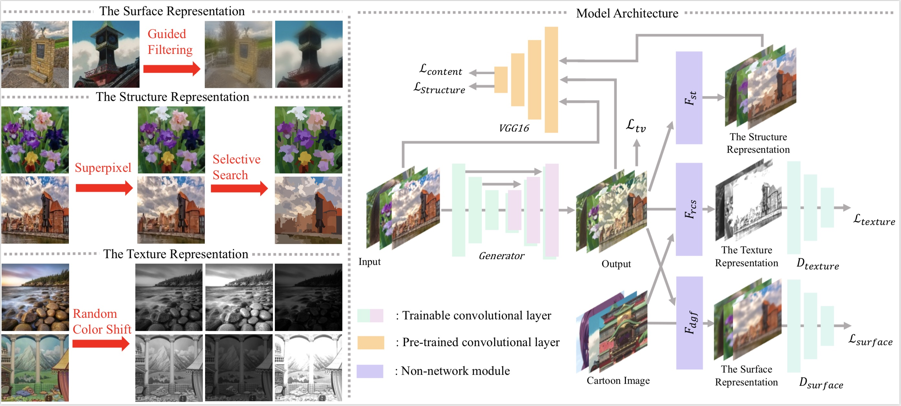
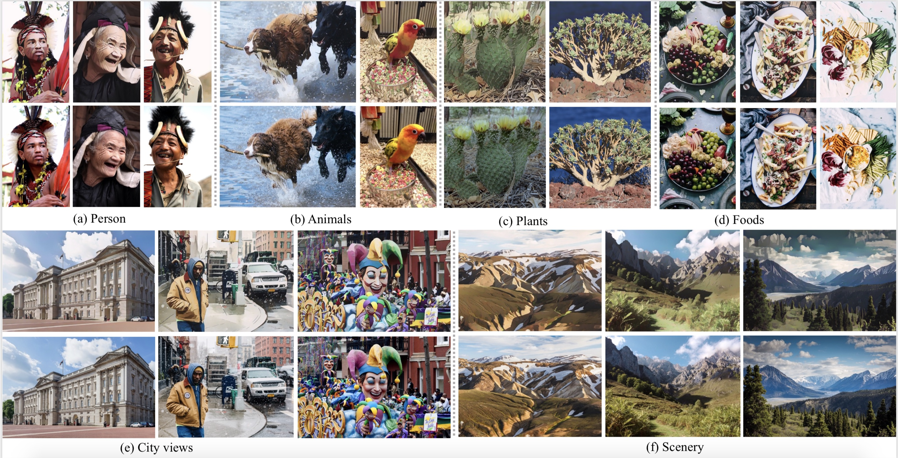
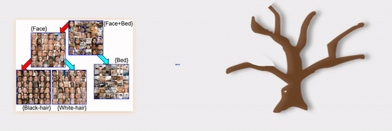
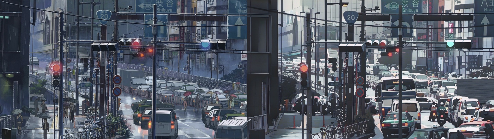

<div align="center">

  <a name="readme-top"></a>
  # White-Box Cartoonization

  [](LICENSE)
  
  [](https://github.com/Amey-Thakur/WHITE-BOX-CARTOONIZATION)
  [](https://arxiv.org/abs/2107.04551)
  [](https://github.com/Amey-Thakur/WHITE-BOX-CARTOONIZATION)

  An AI-powered web application that transforms photographs into cartoon-style images using deep learning, utilizing a white-box representation framework and Generative Adversarial Networks (GANs).

  **[Source Code](Source%20code/)** &nbsp;&middot;&nbsp; **[Research Paper](https://arxiv.org/abs/2107.04551)** &nbsp;&middot;&nbsp; **[Project Demo](https://youtu.be/8VNc8p6AKmw)**

  [](https://youtu.be/8VNc8p6AKmw)

</div>

---

<div align="center">

  [Authors](#authors) &nbsp;·&nbsp; [Overview](#overview) &nbsp;·&nbsp; [Features](#features) &nbsp;·&nbsp; [Structure](#project-structure) &nbsp;·&nbsp; [Results](#system-architecture--design-gallery) &nbsp;·&nbsp; [Quick Start](#quick-start) &nbsp;·&nbsp; [License](#license) &nbsp;·&nbsp; [About](#about-this-repository) &nbsp;·&nbsp; [Acknowledgments](#acknowledgments)

</div>

---

<!-- AUTHORS -->
<div align="center">

  ## Authors

  **Terna Engineering College | Computer Engineering | Batch of 2022**

  <table>
  <tr>
  <td align="center">
  <a href="https://github.com/Amey-Thakur">
  <br />
  <sub><b>Amey Thakur</b></sub>
  </a>
  </td>
  <td align="center">
  <a href="https://github.com/rizvihasan">
  <br />
  <sub><b>Hasan Rizvi</b></sub>
  </a>
  </td>
  <td align="center">
  <a href="https://github.com/msatmod">
  <br />
  <sub><b>Mega Satish</b></sub>
  </a>
  </td>
  </tr>
  </table>

  *Special thanks to [Hasan Rizvi](https://github.com/rizvihasan) and [Mega Satish](https://github.com/msatmod) for their meaningful contributions, guidance, and support that helped shape this work.*

</div>

---

<!-- OVERVIEW -->
## Overview

**White-Box Cartoonization** is an advanced AI implementation designed to bridge the gap between real-world imagery and artistic cartoon representations. Unlike black-box models, this system decomposes images into several representations (surface, structure, and texture) to achieve high-quality stylization while maintaining the structural integrity of the input.

Developed as a mini-project for the **Machine Learning Laboratory** curriculum, this project integrates cutting-edge deep learning research with a production-ready Flask web gateway, demonstrating the end-to-end lifecycle of an AI application.

> [!IMPORTANT]
> **Research Impact**
>
> This project was published as a research paper in the **International Journal of Engineering Applied Sciences and Technology (IJEAST)** (Volume 5, Issue 12) and is also available as a preprint on **arXiv**.
>
> - [Preprint @arXiv](https://arxiv.org/abs/2107.04551)
> - [Published Paper @IJEAST](http://dx.doi.org/10.33564/IJEAST.2021.v05i12.049)

### Resources

| # | Resource | Description | Date | Link |
|---|---|---|---|---|
| 1 | **Project Repository** | Complete source code and production weights | — | [View](Source%20code/) |
| 2 | **Technical Report** | Comprehensive archival project documentation | 2021 | [View](Research-and-Training/WHITE-BOX%20CARTOONIZATION%20USING%20AN%20EXTENDED%20GAN%20FRAMEWORK%20REPORT.pdf) |
| 3 | **Technical Presentation** | Visual overview of the model architecture | 2021 | [View](Research-and-Training/WHITE-BOX%20CARTOONIZATION%20USING%20AN%20EXTENDED%20GAN%20FRAMEWORK%20PRESENTATION.pdf) |
| 4 | **Project Demo (YouTube)** | Real-time demonstration of the web portal | — | [View](https://youtu.be/8VNc8p6AKmw) |
| 5 | **Scholarly Preprint** | Formal research manuscript (arXiv version) | 2021 | [View](https://arxiv.org/pdf/2107.04551.pdf) |

---

<!-- FEATURES -->
## Features

| Feature | Description |
|---------|-------------|
| **White-Box Logic** | Decomposition-based cartoonization for superior edge and texture control. |
| **GAN Framework** | Extended Generative Adversarial Network for realistic artistic textures. |
| **Optimized Inference** | Efficient model execution via TensorFlow with Guided Filter refinement. |
| **Cinematic Web UI** | Modern HTML/JS interface featuring clapper animations and soundscapes. |
| **Cross-Platform** | Fully responsive design supporting both desktop and mobile web environments. |
| **Archival Quality** | Production-ready code with comprehensive scholarly documentation. |

### Tech Stack
- **Framework**: TensorFlow 2.x
- **Backend**: Python 3.8+, Flask 3.1.2
- **Frontend**: Vanilla JS, CSS3 (Custom Theme System)
- **Utilities**: OpenCV, NumPy, Guided Filter algorithm

---

<!-- STRUCTURE -->
## Project Structure

```bash
WHITE-BOX-CARTOONIZATION/
│
├── Mega/                                          # Archival Attribution Assets
│   └── Mega.png                                   # Author Profile Image (Mega Satish)
│
├── Research-and-Training/                         # Academic & Research Core
│   ├── Mini-Project/                              # Training Implementation & Data
│   │   ├── WBC/                                   # Core Training Script Manifest
│   │   ├── Files/                                 # Visualization & Research Data
│   │   └── Demo/                                  # Qualitative Performance Videos
│   ├── Experimental-Implementations/              # Notebooks & TF.js Experiments
│   ├── WHITE-BOX...PRESENTATION.pdf               # Technical Presentation Assets
│   └── WHITE-BOX...REPORT.pdf                     # Formal Academic Report
│
├── Source code/                                   # Production-Ready Application
│   ├── src/                                       # Core Inference Logic
│   │   ├── saved_models/                          # Pre-trained Model Weights
│   │   ├── network.py                             # U-Net Architecture Definition
│   │   └── guided_filter.py                       # Mathematical Refinement Layer
│   ├── static/                                    # Frontend Presentation Assets
│   │   ├── css/                                   # Dynamic Styling (Mobile/Theme)
│   │   └── js/main.js                             # Asynchronous UI Orchestration
│   ├── app.py                                     # Flask Web Entry Gateway
│   ├── backend.py                                 # GAN Processing Liaison
│   └── index.html                                 # Application Frontend Blueprint
│
├── .gitattributes                                 # Global Git LFS & Config
├── .gitignore                                     # Asset Exclusion Manifest
├── CITATION.cff                                   # Scholarly Citation Metadata
├── LICENSE                                        # MIT License Terms
├── README.md                                      # Comprehensive Archival Entrance
└── SECURITY.md                                    # Vulnerability Exposure Policy
```

---

<!-- RESULTS -->
## System Architecture & Design Gallery

<div align="center">

  ### AI Model Architecture
  

  ### System Use Cases
  

  ### GAN Learning Visualization
  

  ### Qualitative Analysis (Shinjuku Dataset)
  

</div>

---

<!-- QUICK START -->
## Quick Start

### 1. Prerequisites
Ensure your environment meets the minimum specifications:
- **Python**: Version **3.8** or higher.
- **Hardware**: 4GB Minimum RAM (8GB recommended for inference).
- **Environment**: Virtual environment (venv) is highly recommended.

### 2. Setup & Deployment
1.  **Clone the Repository**:
    ```bash
    git clone https://github.com/Amey-Thakur/WHITE-BOX-CARTOONIZATION.git
    cd WHITE-BOX-CARTOONIZATION
    ```
2.  **Install Dependencies**:
    ```bash
    pip install flask flask-cors tensorflow opencv-python numpy tf-slim
    ```

### 3. Launch Application
1.  **Start the Server**:
    ```bash
    cd "Source code"
    python app.py
    ```
2.  **Access Web Gateway**:
    -   Navigate to: `http://localhost:5002`

---

<!-- LICENSE -->
## License

This project is licensed under the **MIT License** - see the [LICENSE](LICENSE) file for details.

**Summary**: You are free to share and adapt this content for any purpose, even commercially, as long as you provide appropriate attribution to the original authors.

**Copyright &copy; 2021** [Amey Thakur](https://github.com/Amey-Thakur), [Hasan Rizvi](https://github.com/rizvihasan), [Mega Satish](https://github.com/msatmod)

---

<!-- ABOUT -->
## About This Repository

**Created & Maintained by**: [Amey Thakur](https://github.com/Amey-Thakur), [Hasan Rizvi](https://github.com/rizvihasan) & [Mega Satish](https://github.com/msatmod)  
**Academic Journey**: Bachelor of Engineering in Computer Engineering (2018-2022)  
**Institution**: [Terna Engineering College](https://ternaengg.ac.in/), Navi Mumbai  
**University**: [University of Mumbai](https://mu.ac.in/)

This repository serves as a permanent technical record for **White-Box Cartoonization**, developed as a **6th Semester Mini-Project**. It highlights the practical application of GANs in artistic rendering and the deployment of AI models via modern web interfaces.

**Connect**: [GitHub](https://github.com/Amey-Thakur) · [LinkedIn](https://www.linkedin.com/in/amey-thakur)

### Acknowledgments

Grateful acknowledgment to **[Hasan Rizvi](https://github.com/rizvihasan)** and **[Mega Satish](https://github.com/msatmod)** for their pivotal roles and collaborative excellence during the development of this project. Their intellectual contributions, technical insights, and dedicated commitment to software quality were fundamental in achieving the system's analytical and functional objectives. This technical record serves as a testament to their scholarly partnership and significant impact on the final implementation.

Special thanks to the authors of *"Learning to Cartoonize Using White-box Cartoon Representations"* (Xinrui Wang and Jinze Yu, CVPR 2020) for their foundational research.

---

<div align="center">

  [↑ Back to Top](#readme-top)

  [Authors](#authors) &nbsp;·&nbsp; [Overview](#overview) &nbsp;·&nbsp; [Features](#features) &nbsp;·&nbsp; [Structure](#project-structure) &nbsp;·&nbsp; [Results](#system-architecture--design-gallery) &nbsp;·&nbsp; [Quick Start](#quick-start) &nbsp;·&nbsp; [About](#about-this-repository) &nbsp;·&nbsp; [Acknowledgments](#acknowledgments)

  <br>

  🔬 **[Machine Learning Laboratory](https://github.com/Amey-Thakur/MACHINE-LEARNING-LAB)** &nbsp;·&nbsp; 🎨 **[White Box Cartoonization](https://github.com/Amey-Thakur/WHITE-BOX-CARTOONIZATION)**

  ---

  ### Presented as part of the 6th Semester Mini-Project @ Terna Engineering College

  ### 🎓 [Computer Engineering Repository](https://github.com/Amey-Thakur/COMPUTER-ENGINEERING)

  **Computer Engineering (B.E.) - University of Mumbai**

  *Semester-wise curriculum, laboratories, projects, and academic notes.*

</div>
