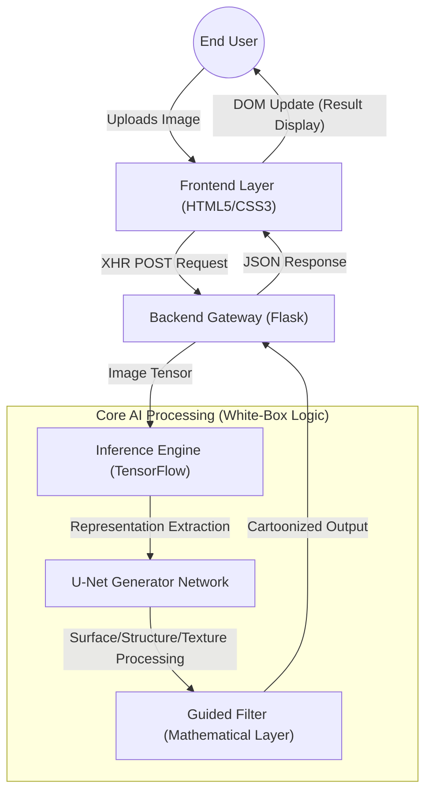

# Technical Specification: WHITE-BOX-CARTOONIZATION

## Architectural Overview

**White-Box Cartoonization** is a deep learning-based image transformation system that utilizes a white-box representation framework to convert real-world photographs into high-quality cartoon images. Unlike standard "black-box" models, this architecture decomposes images into three distinct components—**Surface**, **Structure**, and **Texture**—to maintain artistic control and structural integrity throughout the GAN-based generation process.

### Processing Pipeline Diagram

---

## Technical Implementations

### 1. Neural Engine: TensorFlow & GAN Framework
The core of the system is built on an extended **Generative Adversarial Network (GAN)** framework.
-   **White-Box Representation**: The model explicitly processes the surface representation (smooth textures), structure representation (global shapes), and texture representation (detailed lines) separately to achieve superior artistic results.
-   **Generator Architecture**: Utilizes a **U-Net** based generator (`network.py`) with residual blocks to preserve feature resolutions during the upsampling/downsampling stages.
-   **Output Refinement**: A **Guided Filter** implementation (`guided_filter.py`) is used as a post-processing layer to ensure edges remain sharp and the final image preserves semantic information from the input.

### 2. Application Layer: Flask Web Gateway
The backend serves as an orchestration layer between the user interface and the AI model.
-   **Inference Liaison**: `backend.py` manages the pre-computation and model loading, ensuring that the heavy TensorFlow graph is initialized once and reused for multiple user requests.
-   **RESTful Endpoint**: `app.py` exposes a `/cartoonize` endpoint that handles standard HTTP requests, image normalization, and data serialization.

### 3. Presentation Layer: Vanilla Web Stack
The frontend is designed for high performance and responsiveness without heavy framework overhead.
-   **Dynamic Styling**: Implements a custom CSS3 theme system (`theme.css`, `style.css`) that adapts to both desktop and mobile viewports.
-   **Asynchronous Orchestration**: `main.js` manages the image upload lifecycle, camera integration, and state-based UI updates using modern `fetch` APIs and async/await patterns.

---

## Technical Prerequisites

-   **Runtime**: Python 3.8 or higher
-   **Neural Framework**: TensorFlow 2.x
-   **Server Engine**: Flask 3.1.2
-   **Core Libraries**: `OpenCV-Python` (Image processing), `NumPy` (Tensor manipulation), `tf-slim`.

---

*Technical Specification | Computer Engineering Project | Version 1.0*
